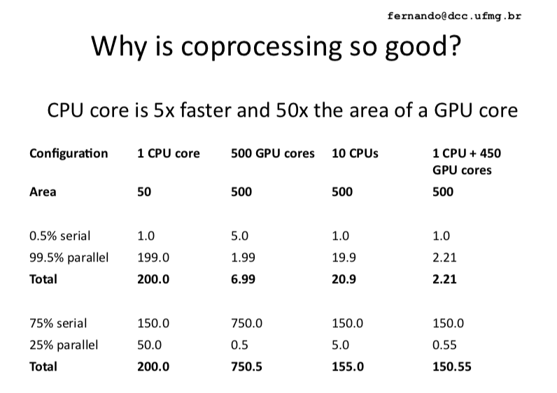

## Laboratório de Introdução à Programação Paralela. 
### Introdução à Programação em CUDA.

**CUDA** é uma plataforma de computação paralela e modelo de programação da NVIDIA para a programação de propósito geral usando GPUs da marca. Programas CUDA são heterogêneos: parte do programa é executado na CPU, enquanto trechos computacionalmente caros executam na GPU. 


(tomado de http:homepages.dcc.ufmg.br/~fernando/classes/gpuOpt/slides/slides1.pdf)

### Primeiro programa: Hello World! (serial)

Vamos testar o *nvcc* (compilador NVIDIA cc) de sua máquina para garantir que está tudo certo. Crie o arquivo *main.cu* contendo o seguinte código:
```cpp
#include <iostream>
using namespace std;
int main() {
		printf("Hello World!\n");
		return 0;
	}
```
Para compilar e executar o programa:
```bash
$ nvcc main.cu -o output
$ ./output
```

### Primeiro programa: Hello World! (paralelo!)
As funções que são lançadas na CPU (chamado de *host* na terminologia CUDA) para execução na GPU (ou *device*) são chamadas de *kernels* e se declaram como **\_\_global\_\_**. O número de threads CUDA que executarão o kernel em uma determinada chamada é especificado usando 
a sintaxe de configuração da execução : <<<...>>>

Crie o arquivo main.cu contendo o seguinte código e compile-o:
```cpp
__global__ void mykernel(void) {
	}

	int main(void) {
		mykernel<<<1,1>>>();
		printf("Hello World!\n");
		return 0;
	}
```

Qual é a saída da execução? 

Agora troque a linha ```mykernel<<<1,1>>>(); ``` por ```mykernel<<<1,8>>>();```
Qual é a saída da execução dessa vez? 
Exatamente 8 vezes o texto "Hello World!", uma vez por cada thread executada na GPU.

A programação CUDA segue um modelo de execução chamado de **SIMT (Single Instruction, Multiple Thread)**. No lugar do modelo **SIMD** descrito na taxonomia de Flynn, em que uma thread de controle processa vários elementos de dado (como nos processadores vetoriais), em SIMT grupos de threads executam a mesma instrução simultâneamente sobre diferentes dados. Em CUDA, esses grupos são chamados de *warps* e até agora são formados estritamente por 32 threads. 

Threads podem ser distinguidas por meio de sua id de thread, que pode ser acessada através da variável threadIdx (uma struct *dim3* com os campos x, y e z). Por exemplo, no exemplo anterior criamos um array unidimensional de threads, o id de uma thread nesse caso é threadIDx.x. 

Exemplo de https://docs.nvidia.com/cuda/cuda-c-programming-guide/index.html que mostra um cálculo usando matrizes bidimensionais. Nesse caso, o id de uma thread com índices threadIdx.x, threadIdx.y pode ser calculado como ```id = threadIdx.x + threadIdx.y * threadsPerBlock```.
```cpp
// Kernel definition
__global__ void MatAdd(float A[N][N], float B[N][N],
                       float C[N][N])
{
    int i = threadIdx.x;
    int j = threadIdx.y;
    C[i][j] = A[i][j] + B[i][j];
}

int main()
{
    ...
    // Kernel invocation with one block of N * N * 1 threads
    int numBlocks = 1;
    dim3 threadsPerBlock(N, N);
    MatAdd<<<numBlocks, threadsPerBlock>>>(A, B, C);
    ...
}
```
O runtime CUDA fornece diversas funções e que permitem definir a quantidade de threads, criar e utilizar mecanismos de sincronização, e várias outras funcionalidades.

### Exercício: Execute o programa deviceQuery no diretório Samples do NVIDIA CUDA Toolkit em /usr/local/cuda/cuda9-installed-samples/NVIDIA_CUDA-9.0_Samples/1_Utilities/
- Pesquise e responda (você pode consultar também https://en.wikipedia.org/wiki/CUDA, https://docs.nvidia.com/cuda/cuda-c-programming-guide/index.html): 
  - Qual é a compute capability (capacidade de computação) da sua GPU?
  - Quais são as dimensões máximas do bloco para GPUs com a capacidade de computação da placa Tesla K40?
  - Suponha que você esteja  executando numa grid e um bloco unidimensionais. Se a dimensão máxima da grid do hardware for 65535 e a dimensão máxima do bloco for 512, qual é o número máximo de threads que podem ser lançados na GPU?
  - O que é memória compartilhada?
  - O que é memória global?
  - Em que condições um programador pode escolher não querer lançar o número máximo de threads?
  - O que pode limitar um programa de iniciar o número máximo de threads em uma GPU?

## Problema 1 - Soma de vetores
Na aula passada resolvemos o problema da soma de vetores usando um bloco só. Nessa aula iremos escrever um programa que resolve esse problema para N > o tamanho de um bloco. 
[Clique aqui para entender como configurar sua execução](./images/Lab_Intro_GPU.pdf)

É altamente recomendável incluir no seu código o seguinte trecho para verificação de erros:
```cpp
#ifndef checkCudaErrors
static void HandleError( cudaError_t err, const char *file, int line ) {
    if (err != cudaSuccess) {
        printf( "%s in %s at line %d\n", cudaGetErrorString( err ),
                file, line );
        exit( EXIT_FAILURE );
    }
}
#define checkCudaErrors( err ) (HandleError( err, __FILE__, __LINE__ ))
#endif

Exemplo:
checkCudaErrors(cudaMalloc((void**)&d_A, bytes_N));
```
enquanto o seguinte código pode ser utilizado para medir o tempo de execução:
```cpp
    cudaEvent_t     start, stop;
    HANDLE_ERROR( cudaEventCreate( &start ) );
    HANDLE_ERROR( cudaEventCreate( &stop ) );
    HANDLE_ERROR( cudaEventRecord( start, 0 ) );
    kernel<<<grids,threads>>>(args);//alocação, chamada ao kernel, copia de dados
    HANDLE_ERROR( cudaEventRecord( stop, 0 ) );
    HANDLE_ERROR( cudaEventSynchronize( stop ) );
    float   elapsedTime;
    HANDLE_ERROR( cudaEventElapsedTime( &elapsedTime,
                                        start, stop ) );
    printf( "Time to generate:  %3.1f ms\n", elapsedTime );

    HANDLE_ERROR( cudaEventDestroy( start ) );
    HANDLE_ERROR( cudaEventDestroy( stop ) );
```

## Problema 2 - Tempo e verificação de erros

[Para ver a descrição do problema clique aqui](./flops)

Controle de divergências.
Já que grupos de 32 threads (um warp) executam a mesma instrução, como são tratadas as divergências em CUDA?
Isto pode danificar o desempenho, a programação, no possível, deve levar em conta o nível de warps para maximizar o desempenho. 
https://devblogs.nvidia.com/using-cuda-warp-level-primitives/

